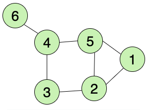
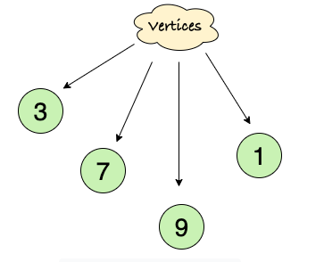
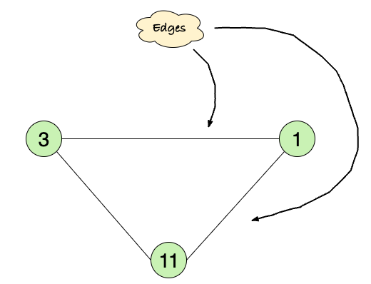
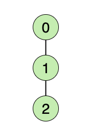
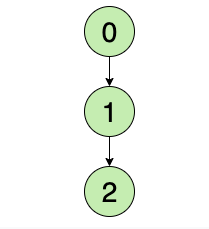
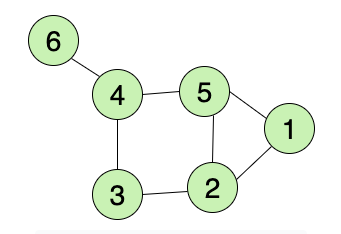
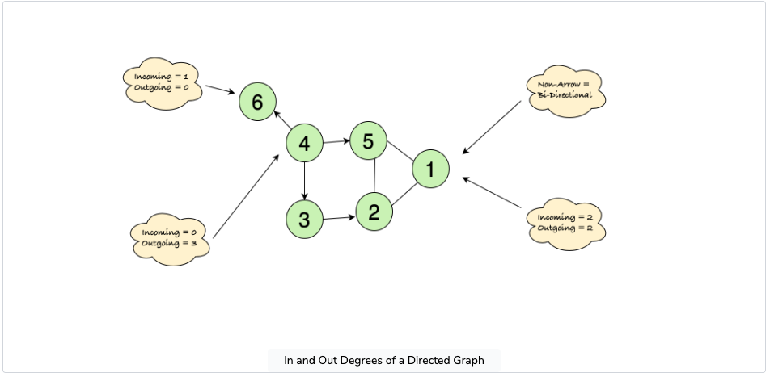
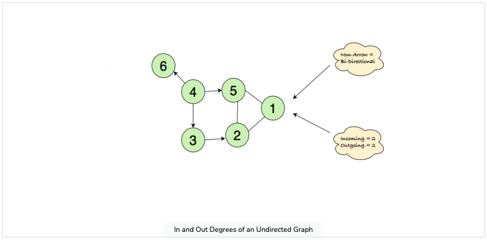
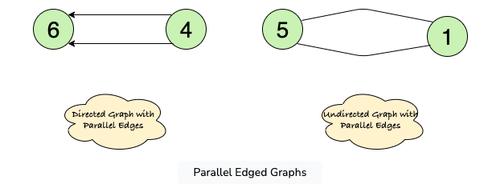
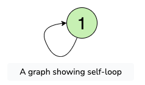

**# What is a Graph?**

The lesson explains multiple types and terminologies used in graphs (from basic to complex).

## Introduction

### How do you Define a Graph?

A graph is a set of vertices (nodes) that are connected to each other via edges in the form of a network.

A Graph having 6 nodes and 7 edges

## Vertex:

The structures for storing data in a graph, represented in the form of Nodes (1,3,7…), are also called Vertices

A Graph having 4 Vertices

## Edge:

A pair(x,y) is called an edge, which indicates that vertex x is connected to vertex y. An edge may contain weight/cost, showing how much cost is required to traverse from vertex x to y.

Edges are usually represented using Straight lines.

A Graph having 3 Edges

## Types of Graphs

There are two common types of graphs:

1. Undirected
2. Directed

### 1. Undirected Graph

In an undirected graph, the edges are bi-directional by default; for example, with the pair (0,1), it means there exists an edge between vertex 0 and 1 without any specific direction. You can go from vertex 0 to 1, or vice versa.

An Undirected Graph having 3 vertices and 2 edges

### 2. Directed Graph

In a directed graph, the edges are unidirectional; for example, with the pair (0,1), it means there exists an edge from vertex 0 towards vertex 1, and the only way to traverse is to go from 0 to 1.

A Directed Graph having 3 vertices and 2 edges

## Graph Terminologies

1. Degree of Vertex: Total Number of edges connected to a vertex.

Consider the figure given below:

=> Degree of 5 = 3
=> Degree of 1 = 2
=> Degree of 6 = 1

A Graph having 6 nodes and 7 edges

There are two types of degrees:

* In-Degree of Vertex: Total Number of incoming edges connected to a vertex.
* Out-Degree of Vertex: Total Number of outgoing edges connected to a vertex.

In and Out Degrees of a Directed Graph

In and Out Degrees of an Undirected Graph

2. Parallel Edges: Two or more edges that are incident to the same two vertices.
   

Parallel Edged Graphs

3. Self Loop: Same endpoints of an edge, e.g., pair (x,x).

   

A graph showing self-loop
